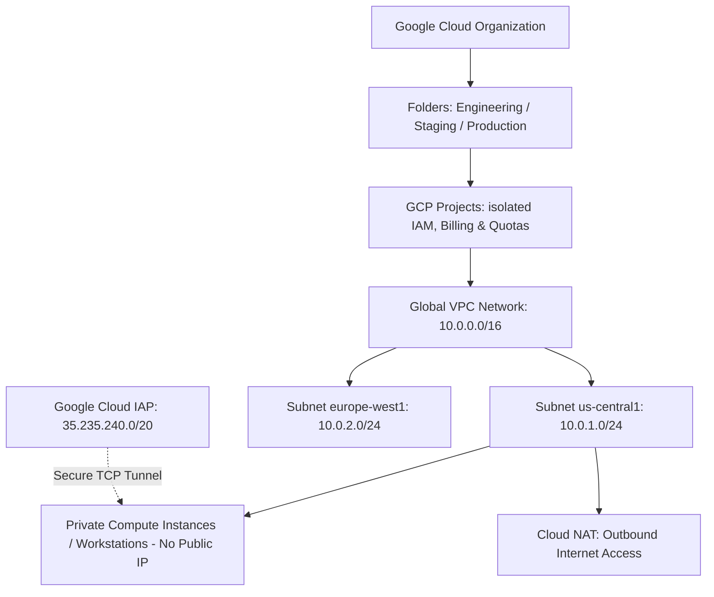
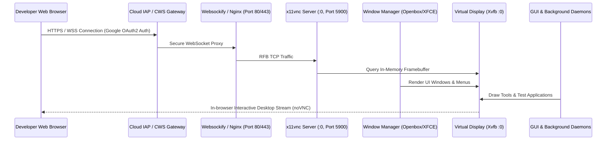
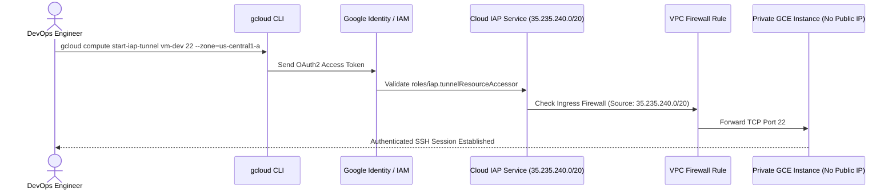
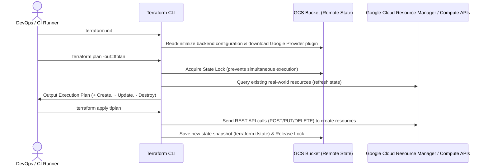
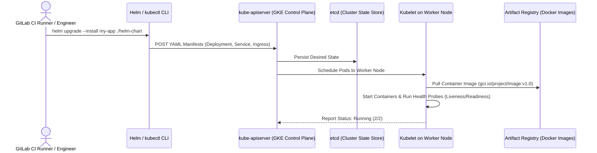

# GCP Cloud & DevOps Interview Preparation Guide: Master Encyclopedia (A to Z)

A comprehensive, scenario-driven interview preparation manual covering Google Cloud Platform (GCP), Containerization, In-Browser Desktop Environments, GitLab CI/CD, Zero-Trust Security (IAP), Secret Management, IAM, FinOps Cost Optimization, Terraform & Kubernetes Position Strategy, 20+ Detailed Interview Q&As, and Behavioral STAR Frameworks.

---

## Table of Contents
1. [Module 1: GCP Core Hierarchy & Networking Fundamentals](#module-1-gcp-core-hierarchy--networking-fundamentals)
2. [Module 2: Google Cloud Workstations (CWS) & Container Packaging Architecture](#module-2-google-cloud-workstations-cws--container-packaging-architecture)
3. [Module 3: CI/CD Orchestration with GitLab CI](#module-3-cicd-orchestration-with-gitlab-ci)
4. [Module 4: GCP Security — Cloud Identity-Aware Proxy (IAP) TCP Tunneling](#module-4-gcp-security--cloud-identity-aware-proxy-iap-tcp-tunneling)
5. [Module 5: GCP Secret Manager, KMS & Least-Privilege IAM](#module-5-gcp-secret-manager-kms--least-privilege-iam)
6. [Module 6: Ephemeral Infrastructure & FinOps Cost Optimization](#module-6-ephemeral-infrastructure--finops-cost-optimization)
7. [Module 7: Infrastructure as Code (Terraform) & Kubernetes (GKE) Execution Mechanics](#module-7-infrastructure-as-code-terraform--kubernetes-gke-execution-mechanics)
8. [Module 8: Advanced Enterprise Cloud & DevOps Concepts Checklist](#module-8-advanced-enterprise-cloud--devops-concepts-checklist)
9. [Module 9: Handling Questions on Terraform / Kubernetes Responsibility](#module-9-handling-questions-on-terraform--kubernetes-responsibility)
10. [Module 10: Master Bank of 25+ Technical Interview Questions & Model Answers](#module-10-master-bank-of-25-technical-interview-questions--model-answers)
11. [Module 11: Behavioral & STAR Method Interview Master Frameworks](#module-11-behavioral--star-method-interview-master-frameworks)
12. [Module 12: Shell Scripting Automation & JFrog Artifactory Concepts](#module-12-shell-scripting-automation--jfrog-artifactory-concepts)
13. [Module 13: Bash & Shell Scripting Core Fundamentals](#module-13-bash--shell-scripting-core-fundamentals)
14. [Module 14: TCS GCP DevOps Walk-In (19 Sep 2026) — JD Gap Analysis & Prep Plan](#module-14-tcs-gcp-devops-walk-in-19-sep-2026--jd-gap-analysis--prep-plan)

---

## Module 1: GCP Core Hierarchy & Networking Fundamentals



### 1. Resource Hierarchy
* **Organization:** The root node representing the enterprise domain. Organization policies (e.g., disable external IP creation) enforce guardrails across all teams.
* **Folders:** Groupings used to model departments (Engineering, QA, Production) and apply regional/environment IAM roles.
* **Projects:** The fundamental boundary for billing, resource quotas, and access permissions. Resources in separate projects are strictly isolated unless explicitly peered or connected via Shared VPC.

### 2. Global VPC & Subnets
* **Global VPC vs Subnets:** Unlike AWS where VPCs are regional, GCP VPCs are **global**. Subnets inside the VPC are **regional**.
* **Private Google Access (PGA):** Enabled on a subnet level. Allows VM instances without external public IP addresses to securely reach Google APIs (Cloud Storage, Secret Manager, Container Registry, Cloud Logging) over Google's internal fiber network.
* **Cloud NAT (Network Address Translation):** A software-defined, managed NAT service that allows private VM instances to initiate outbound connections (for `apt-get`, downloading packages, or external API calls) without assigning public IPv4 addresses to the VMs. It strictly blocks unsolicited inbound traffic from the internet.

### 3. Firewall Rules & Security
* Stateful filtering evaluated per VPC.
* Default rule allows all outbound traffic (`0.0.0.0/0`).
* Default rule blocks all inbound traffic.
* Zero-Trust ingress rule: Allow TCP traffic (port 22 for SSH, 80/443 for web) **only from source range `35.235.240.0/20`** (Google IAP CIDR).

---

## Module 2: Google Cloud Workstations (CWS) & Container Packaging Architecture



### 1. Concept Deep Dive
* **What is Google Cloud Workstations (CWS)?**
  * A managed service that provisions isolated, container-based developer environments on GCP infrastructure.
  * Workstations run inside managed VPCs, integrate natively with IAM and IAP, support automatic idle timeouts, and allow developers to access full Linux GUI tools or IDEs directly in any web browser.
* **Architecture of In-Browser GUI Containers (noVNC + X11 + Supervisord):**
  * **Xvfb (X Virtual Framebuffer):** Emulates an X11 display server entirely in memory (`DISPLAY=:0`) without requiring a physical graphics card or monitor.
  * **Window Manager (Openbox / XFCE):** Manages window borders, focus, and desktop interactions.
  * **x11vnc:** Grabs the memory framebuffer from Xvfb and serves it over the standard Remote Framebuffer (RFB) protocol (typically TCP port 5900).
  * **Websockify:** Converts raw RFB TCP socket traffic into WebSocket protocol packets.
  * **noVNC:** An HTML5/JavaScript client that connects via WebSockets and renders the desktop canvas inside the browser.
  * **Supervisor / supervisord:** A Linux process management daemon that starts, monitors, and restarts all required sub-processes (Xvfb, window manager, x11vnc, websockify, background utilities).

### 2. Dockerfile Optimization Blueprint
```dockerfile
# Multi-stage base setup
FROM debian:bookworm-slim AS base

# Prevent interactive prompts during package install
ENV DEBIAN_FRONTEND=noninteractive

# Single-layer package installation with immediate cache cleanup
RUN apt-get update && apt-get install -y --no-install-recommends \
    xvfb \
    x11vnc \
    openbox \
    novnc \
    websockify \
    supervisor \
    curl \
    ca-certificates \
    && apt-get clean \
    && rm -rf /var/lib/apt/lists/*

# Copy configuration and startup scripts last to maximize layer caching
COPY supervisor.conf /etc/supervisor/conf.d/supervisord.conf
COPY entrypoint.sh /usr/local/bin/entrypoint.sh

RUN chmod +x /usr/local/bin/entrypoint.sh

EXPOSE 80 443

ENTRYPOINT ["/usr/local/bin/entrypoint.sh"]
CMD ["/usr/bin/supervisord", "-c", "/etc/supervisor/conf.d/supervisord.conf"]
```

---

## Module 3: CI/CD Orchestration with GitLab CI

```mermaid
graph LR
    subgraph Parent Pipeline
        Lint[Job: Lint & Preflight] --> Build[Job: Docker Multi-Stage Build]
        Build --> Trigger[Job: Trigger Child Pipeline]
    end

    subgraph Child Pipeline
        Trigger --> TestUnit[Job: Integration & Unit Tests]
        TestUnit --> DeployEphemeral[Job: Deploy Ephemeral Test Envs]
        DeployEphemeral --> Teardown[Job: Cleanup & Teardown (when: always)]
    end
```

### 1. Essential Pipeline Mechanics
* **Modular Pipeline Architecture (`include:`):**
  Instead of maintaining huge monolithic pipeline files, break pipelines into reusable templates:
  ```yaml
  include:
    - local: '/ci/templates/lint.gitlab-ci.yml'
    - local: '/ci/templates/docker-build.gitlab-ci.yml'
    - local: '/ci/templates/security-scan.gitlab-ci.yml'
  ```
* **Directed Acyclic Graph (DAG) with `needs:`:**
  By default, jobs in stage $N+1$ wait for **all** jobs in stage $N$ to complete. Using `needs: [job_name]` allows independent jobs to execute as soon as their direct prerequisites finish, significantly reducing pipeline execution time.
* **Rules & Conditional Execution (`rules:if`):**
  Trigger specific child pipelines or build jobs only when relevant directories or branch conditions are met:
  ```yaml
  build_container:
    stage: build
    rules:
      - if: '$CI_COMMIT_BRANCH == "main"'
        changes:
          - docker-cws-vp/**/*
  ```
* **Cache vs Artifacts:**
  * **Cache:** Temporary storage for speed (e.g., `.npm/`, `pip-cache/`, Docker layers). Missing cache will not fail the build.
  * **Artifacts:** Immutable build results (binaries, test reports, tarballs) passed between stages or stored for release compliance.

---

## Module 4: GCP Security — Cloud Identity-Aware Proxy (IAP) TCP Tunneling



### 1. Concept Deep Dive
* **Why Eliminate Bastion Hosts?**
  * Traditional bastion hosts require public IP addresses, dedicated VM compute costs, manual SSH key management, OS patching, and are vulnerable to brute-force network scanning.
  * **Cloud IAP TCP Tunneling** provides Zero-Trust access: instances remain 100% private, authenticated via Google IAM and OAuth2 tokens. Traffic is proxied over HTTPS directly to the target port.
* **Firewall Configuration Requirement:**
  ```bash
  gcloud compute firewall-rules create allow-iap-tcp \
    --network=default \
    --allow=tcp:22,tcp:80,tcp:443 \
    --source-ranges=35.235.240.0/20 \
    --target-tags=iap-enabled
  ```
* **How Engineers Connect:**
  ```bash
  # SSH through IAP
  gcloud compute ssh instance-name --zone=us-central1-a --tunnel-through-iap

  # Forward any arbitrary TCP port (e.g., database port 5432 or web port 8080)
  gcloud compute start-iap-tunnel instance-name 8080 --local-host-port=localhost:8080 --zone=us-central1-a
  ```

---

## Module 5: GCP Secret Manager, KMS & Least-Privilege IAM

```mermaid
graph TD
    GitLabRunner[GitLab CI Runner / Container Workload] -->|Presents OIDC JWT Token| STS[Google Security Token Service (STS)]
    STS -->|Validates Audience & Claims| WIP[Workload Identity Pool & Provider]
    WIP -->|Impersonates| SA[GCP Service Account: sa-ci-cd@project.iam.gserviceaccount.com]
    SA -->|Authorized by roles/secretmanager.secretAccessor| SM[Secret Manager Vault]
    SM -->|Returns Decrypted Secret String| GitLabRunner
```

### 1. Dynamic Secret Injection
* Static credentials stored in repositories, Docker images, or unmasked CI variables present extreme security vulnerabilities.
* Secret Manager encrypts secrets at rest using Cloud KMS and in transit.
* Secrets are retrieved on-the-fly at container startup or CI runtime:
  ```bash
  # Shell injection
  export API_KEY=$(gcloud secrets versions access latest --secret="external-api-key")
  ```

### 2. Workload Identity Federation vs Service Account Keys
* **Exported JSON Keys (High Risk Antipattern):** Long-lived static credentials that cannot be automatically rotated and risk being leaked.
* **Workload Identity Federation (Zero-Trust Modern Standard):** External workloads (GitLab CI, GitHub Actions) present an OpenID Connect (OIDC) token. GCP exchanges this token for a short-lived (1-hour), auto-expiring OAuth2 access token.

### 3. Least-Privilege IAM Enforcement
* Never assign primitive roles (`Owner`, `Editor`, `Viewer`).
* Assign `roles/secretmanager.secretAccessor` scoped strictly to the specific secret path rather than project-wide:
  ```bash
  gcloud secrets add-iam-policy-binding external-api-key \
    --member="serviceAccount:sa-workstation@my-project.iam.gserviceaccount.com" \
    --role="roles/secretmanager.secretAccessor"
  ```

---

## Module 6: Ephemeral Infrastructure & FinOps Cost Optimization

| Cost Optimization Area | Implementation Strategy | Business & Technical Impact |
|---|---|---|
| **Development Workstations** | Automated 30-minute idle shutdown policy via Cloud Workstation configuration | 60-70% reduction in developer workstation compute costs |
| **CI/CD Test Instances** | Ephemeral provisioning per test run with guaranteed `when: always` teardown hooks | Zero idle VM charges during off-hours and weekends |
| **Orphaned VM Garbage Collector** | Scheduled Cloud Function / Cron job scanning for instances tagged `environment=ephemeral` with `uptime > 4h` | Eliminates runaway compute resources from aborted pipelines |
| **Storage Hygiene** | Artifact Registry cleanup policies auto-deleting untagged container images older than 30 days | Prevents uncontrolled growth of storage and snapshot costs |

### Cloud Logging & Log-Based Auditing Queries
Querying instance start and stop events in GCP Cloud Logging (Log Analytics):
```sql
resource.type="gce_instance"
AND protoPayload.methodName=("v1.compute.instances.start" OR "v1.compute.instances.stop")
```
Tracking unauthorized public IP attachments:
```sql
resource.type="gce_instance"
AND protoPayload.methodName="v1.compute.instances.addAccessConfig"
```

---

## Module 7: Infrastructure as Code (Terraform) & Kubernetes (GKE) Execution Mechanics

### 1. How Terraform is Invoked (From Code to Cloud)



#### The 4 Core Terraform Commands & What Happens Under the Hood
1. **`terraform init`**
   * Configures the remote state backend (e.g., Google Cloud Storage bucket).
   * Downloads provider plugins (e.g., `hashicorp/google`) into `.terraform/providers/`.
2. **`terraform plan -out=tfplan`**
   * Reads existing state from GCS, queries GCP APIs to compare live infrastructure with your `.tf` code, and outputs a diff (`+` create, `~` modify, `-` destroy).
   * Saves the plan binary to ensure that what was reviewed is exactly what gets applied.
3. **`terraform apply tfplan`**
   * Executes API calls against GCP, waits for resources to become active, and writes the new state snapshot (`terraform.tfstate`) to the GCS bucket while releasing the lock.
4. **`terraform destroy`**
   * Reads state file and sends deletion API calls for all managed resources.

#### Real-World Terraform Example (`main.tf` for GCP)
```hcl
# 1. Configure Remote State Backend in GCS with State Locking
terraform {
  required_version = ">= 1.5.0"
  backend "gcs" {
    bucket = "my-company-tf-state-prod"
    prefix = "infrastructure/workstations"
  }
  required_providers {
    google = {
      source  = "hashicorp/google"
      version = "~> 5.0"
    }
  }
}

provider "google" {
  project = "my-gcp-project-id"
  region  = "us-central1"
}

# 2. Declare a Private VPC & Subnet
resource "google_compute_network" "custom_vpc" {
  name                    = "workstation-vpc"
  auto_create_subnetworks = false
}

resource "google_compute_subnetwork" "private_subnet" {
  name                     = "private-workstation-subnet"
  ip_cidr_range            = "10.10.0.0/24"
  region                   = "us-central1"
  network                  = google_compute_network.custom_vpc.id
  private_ip_google_access = true # Enables Private Google Access
}

# 3. Allow Cloud IAP Ingress
resource "google_compute_firewall" "allow_iap" {
  name    = "allow-iap-traffic"
  network = google_compute_network.custom_vpc.name

  allow {
    protocol = "tcp"
    ports    = ["22", "80", "443"]
  }

  source_ranges = ["35.235.240.0/20"] # Google IAP CIDR
}
```

#### How Terraform is Invoked in GitLab CI/CD
```yaml
stages:
  - validate
  - plan
  - apply

terraform_plan:
  stage: plan
  image: hashicorp/terraform:1.6
  script:
    - terraform init
    - terraform plan -out=tfplan
  artifacts:
    paths:
      - tfplan
    expire_in: 1 day

terraform_apply:
  stage: apply
  image: hashicorp/terraform:1.6
  script:
    - terraform init
    - terraform apply -auto-approve tfplan
  when: manual # Requires explicit human approval before running in production
  only:
    - main
```

---

### 2. How Kubernetes (GKE) is Invoked (From Container Image to Live Pods)



#### The Core Kubernetes Workflow & Tools
1. **Authentication:**
   ```bash
   gcloud container clusters get-credentials my-gke-cluster --region=us-central1 --project=my-project-id
   ```
2. **Applying Manifests via `kubectl`:**
   ```bash
   kubectl apply -f deployment.yaml
   kubectl get pods -l app=workstation-gateway
   kubectl rollout status deployment/workstation-gateway
   ```
3. **Deploying via `Helm` (Package Manager):**
   ```bash
   helm upgrade --install workstation-gateway ./charts/workstation-gateway \
     --set image.tag=$CI_COMMIT_SHA \
     --namespace=production
   ```

#### Real-World Kubernetes Manifest Example (`deployment.yaml`)
```yaml
apiVersion: apps/v1
kind: Deployment
metadata:
  name: workstation-gateway
  namespace: default
  labels:
    app: workstation-gateway
spec:
  replicas: 3 # Maintains 3 healthy pod replicas
  strategy:
    type: RollingUpdate
    rollingUpdate:
      maxSurge: 1
      maxUnavailable: 0
  selector:
    matchLabels:
      app: workstation-gateway
  template:
    metadata:
      labels:
        app: workstation-gateway
    spec:
      containers:
      - name: gateway-container
        image: us-central1-docker.pkg.dev/my-project/docker-repo/app:v1.2.0
        ports:
        - containerPort: 8080
        env:
        - name: ENVIRONMENT
          value: "production"
        resources:
          requests:
            cpu: "250m"
            memory: "512Mi"
          limits:
            cpu: "1000m"
            memory: "1Gi"
        # Health Checks
        livenessProbe:
          httpGet:
            path: /healthz
            port: 8080
          initialDelaySeconds: 15
          periodSeconds: 10
        readinessProbe:
          httpGet:
            path: /ready
            port: 8080
          initialDelaySeconds: 5
          periodSeconds: 5
---
apiVersion: v1
kind: Service
metadata:
  name: workstation-gateway-svc
spec:
  type: ClusterIP # Internal load-balanced IP
  selector:
    app: workstation-gateway
  ports:
  - protocol: TCP
    port: 80
    targetPort: 8080
```

#### How Kubernetes Deployment is Invoked in GitLab CI/CD
```yaml
deploy_to_k8s:
  stage: deploy
  image: google/cloud-sdk:alpine
  before_script:
    - gcloud auth activate-service-account --key-file=$GCP_SA_KEY
    - gcloud container clusters get-credentials my-gke-cluster --region us-central1 --project my-project
  script:
    - kubectl set image deployment/workstation-gateway gateway-container=us-central1-docker.pkg.dev/my-project/docker-repo/app:$CI_COMMIT_SHA
    - kubectl rollout status deployment/workstation-gateway # Blocks until rollout completes successfully
  rules:
    - if: '$CI_COMMIT_BRANCH == "main"'
```

---

---

## Module 8: Advanced Enterprise Cloud & DevOps Concepts Checklist

### 1. Enterprise Networking: Shared VPC vs. VPC Peering
* **Shared VPC (Hub & Spoke Model):**
  * One centralized **Host Project** owns and manages the global VPC, subnets, firewall rules, and routes (typically governed by the central Cloud Platform / SRE team).
  * Multiple **Service Projects** (e.g., Workstations, CI runners, dev teams) are attached to the Host Project subnets. This allows service teams to deploy compute resources without managing networking or risking IP conflicts.
* **VPC Network Peering:**
  * Directly peers two independent VPCs using internal IP addresses with zero latency and no external bandwidth fees.
  * Non-transitive routing: Peering $VPC_A \leftrightarrow VPC_B$ and $VPC_B \leftrightarrow VPC_C$ does **not** allow $VPC_A \leftrightarrow VPC_C$.
* **Interview 1-Liner:** *"In our enterprise GCP setup, we used Shared VPC to maintain strict central networking and firewall governance in a Host Project while isolating workload resources in dedicated Service Projects."*

---

### 2. Supply Chain Security: Artifact Registry & Binary Authorization
* **Artifact Registry (Successor to Container Registry GCR):**
  * Supports Docker container images, Helm charts, npm, and Python packages in regional/multi-regional repositories with granular IAM.
* **Container Analysis (Vulnerability Scanning):**
  * Scans images automatically upon push for Common Vulnerabilities and Exposures (CVEs) and package flaws.
* **Binary Authorization:**
  * A deploy-time security control ensuring that only cryptographically signed container images approved by verified CI/CD build attestations can be deployed to GKE or Cloud Workstations, blocking untrusted images.
* **Interview 1-Liner:** *"We utilized GCP Artifact Registry integrated with Container Analysis to automatically scan built images for vulnerabilities before downstream deployment."*

---

### 3. Observability & SRE Metrics (Cloud Logging Sinks, SLI, SLO, SLA)
* **Log Sinks & Export Routing:**
  * Instead of retaining all logs indefinitely in Cloud Logging (incurring high storage costs), Log Sinks route data based on retention needs:
    * **BigQuery Sink:** For security audit analytics and historical querying.
    * **Cloud Storage (GCS) Sink:** For long-term compliance and cold storage.
    * **Pub/Sub Sink:** For real-time SIEM (e.g., Splunk) or automated alert triggers.
* **SLI / SLO / SLA Definitions:**
  * **SLI (Service Level Indicator):** The quantifiable metric measured (e.g., API error rate = 0.05%, 95th percentile latency = 120ms).
  * **SLO (Service Level Objective):** The internal target agreed by the engineering team (e.g., API availability $\ge 99.9\%$).
  * **SLA (Service Level Agreement):** The contractual commitment to external clients with financial penalties if breached (e.g., 99.5% uptime).
* **Interview 1-Liner:** *"We set up Log Sinks to route audit logs to BigQuery for FinOps and security audits, and configured Cloud Monitoring alerting on error-rate SLIs to proactively maintain our 99.9% SLOs."*

---

### 4. Zero-Downtime Deployment Strategies & Rollbacks
* **Rolling Update (Standard):** Incrementally updates Pods or instances with new versions while ensuring a configured minimum number of healthy replicas remain available (`maxSurge`, `maxUnavailable`).
* **Blue/Green Deployment:** Deploys the new version into a parallel, identical environment ("Green"). Once validated, router/Load Balancer traffic is switched instantly from "Blue" to "Green". Provides instant rollback by switching the router back if errors occur.
* **Canary Deployment:** Releases the new container version to a small subset of live traffic (e.g., 5-10%). Once telemetry confirms no error rate spikes, traffic is progressively scaled up to 100%.
* **Interview 1-Liner:** *"For critical releases, we use Canary deployments with automated rollback thresholds in GitLab CI so that any latency or error spike immediately halts the rollout."*

---

### 5. Storage Lifecycle & Backup Management (Cloud Storage / Persistent Disks)
* **GCS Storage Classes:**
  * **Standard:** High-performance, frequent access (active pipeline outputs, recent container artifacts).
  * **Nearline (30-day min):** Backup data accessed less than once a month.
  * **Coldline (90-day min):** Disaster recovery archives accessed less than once a quarter.
  * **Archive (365-day min):** Long-term compliance logs.
* **Automated Object Lifecycle Rules:** Declarative rules in GCS (e.g., transition objects from Standard to Coldline after 30 days, delete after 90 days).
* **Persistent Disk Snapshot Schedules:** Automated delta snapshot policies for VM disks ensuring point-in-time disaster recovery across GCP zones.

---

### 🎯 Master 10-Topic DevOps Preparation Checklist

| # | Topic | Core Tech / Command to Remember | Status |
|---|---|---|---|
| 1 | Google Cloud Workstations (CWS) | In-browser desktop via `Xvfb`, `x11vnc`, `websockify`, `noVNC`, `supervisord` | ✅ Covered |
| 2 | CI/CD Pipeline Engineering | Modular `include:`, DAG `needs:`, conditional `rules:if`, `cache` vs `artifacts` | ✅ Covered |
| 3 | GCP Zero-Trust Security (IAP) | TCP tunneling via `35.235.240.0/20`, no public IPs, bastion elimination | ✅ Covered |
| 4 | Secret Management & IAM | Dynamic injection, `roles/secretmanager.secretAccessor`, Workload Identity OIDC | ✅ Covered |
| 5 | FinOps & Ephemeral Infrastructure | Auto-idle shutdown (30m), `when: always` pipeline teardowns, Cloud Logging audits | ✅ Covered |
| 6 | Terraform Execution Mechanics | `init`, `plan -out=tfplan`, `apply`, state locking in GCS remote backend | ✅ Covered |
| 7 | Kubernetes (GKE) Lifecycle | Manifests (`Deployment`, `ClusterIP` `Service`), `kubectl`, `helm upgrade --install` | ✅ Covered |
| 8 | Enterprise Networking | Shared VPC (Host vs Service Projects), Private Google Access, Cloud NAT | ✅ Covered |
| 9 | Artifact Registry & Supply Chain | Container Analysis vulnerability scanning, Binary Authorization attestations | ✅ Covered |
| 10 | Observability & Deployments | Cloud Logging Sinks (BigQuery/GCS), SLI/SLO/SLA, Rolling vs Blue/Green vs Canary | ✅ Covered |

---

## Module 9: Handling Questions on Terraform / Kubernetes Responsibility

### Strategy 1: The "Platform vs Workload Enablement" Division (Primary Answer)
> *"In our organization, we had a clear architectural division between **Core Platform Engineering** and our **DevOps/Workstation Enablement** scope:*
>
> 1. *The central Core SRE/Platform team was responsible for the foundational, account-level Terraform state and managed Kubernetes/GKE infrastructure.*
> 2. *My responsibility was focused on **Developer Experience, CI/CD orchestration, and workload enablement**—packaging complex multi-process desktop and testing tools into optimized containers, building modular GitLab CI/CD pipelines, configuring IAP zero-trust tunneling, IAM least-privilege, and automated cost optimization.*
> 3. *That said, I have a solid understanding of Terraform workflows (`init`, `plan`, `apply`, state management, modules) and Kubernetes architecture (Pods, Deployments, Services, Ingress, Helm). If required in this role, I can comfortably write Terraform modules and deploy workloads to Kubernetes."*

### Strategy 2: Architectural Justification ("Why not Kubernetes for this specific workload?")
> *"We evaluated that based on our workload requirements:*
> - *Our workloads required full in-browser interactive GUI environments (X11/noVNC), low-level emulation, and specific OS/kernel-level device virtualization that is much simpler and more performant to run in dedicated Cloud Workstation / VM container runtimes rather than standard Kubernetes pods.*
> - *Cloud Workstations provided built-in managed container execution, browser streaming, and idle-timeout policies out of the box without the operational overhead of managing a custom GKE cluster, custom Ingress controllers, and persistent volume management for developer seats.*
> - *For stateless services or web microservices, Kubernetes is definitely the right choice, but for our specialized virtual testing and developer workstations, Cloud Workstations was the most cost-effective and operationally sound solution."*

### Strategy 3: Explaining the Execution Flow in 30 Seconds
> *"In our deployment flow:*
> 1. *For **Terraform**, configurations are written declaratively in `.tf` files with state stored remotely in Google Cloud Storage with state locking. In CI/CD, we run `terraform plan` on merge requests to review resource diffs, and `terraform apply` on merge to main, which interacts directly with Google Cloud APIs to provision VPCs, subnets, and IAM policies.*
> 2. *For **Kubernetes**, after our GitLab CI pipeline builds and pushes the container image to Artifact Registry, we authenticate using `gcloud container clusters get-credentials`. We deploy workloads either using `kubectl apply` or `helm upgrade --install`, which submits manifests to the `kube-apiserver`. The cluster scheduler deploys the pods across worker nodes with rolling updates, liveness/readiness probes, and ClusterIP services for internal routing.*
> 3. *While our core SRE team managed the base cluster provisioning, I fully understand how these deployment lifecycles operate and can build and maintain them from day one."*

---

## Module 10: Master Bank of 25+ Technical Interview Questions & Model Answers

### Category A: Docker & Cloud Workstations
1. **Q: Explain how a browser-based desktop environment (noVNC) runs inside a container on Cloud Workstations.**
   * **Answer:** *"The container runs headless Linux with a virtual X11 server (`Xvfb`) that handles graphics rendering in memory. A lightweight window manager like Openbox renders the desktop UI. `x11vnc` captures the frame buffer and serves it over the RFB protocol. `websockify` bridges that RFB traffic into WebSockets. Finally, `noVNC` provides the HTML5 web client. All these processes are orchestrated under a process supervisor (`supervisord`). When a user accesses the Cloud Workstation port via browser, noVNC renders the interactive desktop smoothly over WebSockets."*

2. **Q: How do you minimize Docker image size and maximize build speed for large development environments?**
   * **Answer:** *"Three main techniques:*
     * *1. Layer Caching: Order instructions from least frequently changed (base OS packages) to most frequently changed (application scripts).*
     * *2. Package Cleanup in Single Layer: Always combine `apt-get update && apt-get install -y ... && rm -rf /var/lib/apt/lists/*` into one `RUN` command.*
     * *3. Multi-Stage Builds: Build binaries or pull dependencies in a builder stage and copy only final release artifacts into the runtime image."*

3. **Q: What is the difference between Google Cloud Workstations and standard Google Compute Engine (GCE) instances?**
   * **Answer:** *"GCE gives you raw virtual machines requiring manual OS patching, networking, and security management. Cloud Workstations is a managed developer environment service where workstations run as managed containers inside a controlled VPC. It provides out-of-the-box browser and IDE remote access, centralized image updates, built-in IAP zero-trust access, and automatic idle shutoff policies to eliminate wasted compute costs."*

4. **Q: What is the difference between `ENTRYPOINT` and `CMD` in Docker?**
   * **Answer:** *"`ENTRYPOINT` defines the base executable that always runs (e.g., `supervisord`), while `CMD` supplies default parameters that can be overridden at runtime."*

---

### Category B: GitLab CI/CD Pipelines
5. **Q: How do you build a modular CI/CD pipeline in GitLab?**
   * **Answer:** *"I break down large pipelines into smaller, reusable component files using the `include:` keyword. For large monorepos, I utilize parent-child pipelines triggered via `rules:changes`. This ensures that only services with actual code changes trigger build and test jobs. I also standardize stages (`lint`, `build`, `test`, `publish`, `cleanup`), use `needs:` for DAG execution to reduce pipeline duration, and maintain consistent environment variables across environments."*

6. **Q: What is the difference between `cache` and `artifacts` in GitLab CI?**
   * **Answer:** *"Artifacts are guaranteed, immutable outputs generated by a job (such as compiled binaries, test reports, or container tarballs) that are passed to subsequent stages and can be downloaded from the UI. Cache is non-guaranteed storage meant to speed up subsequent pipeline runs by saving package dependencies (like node_modules or pip wheels); if the cache is missing, the job should still be able to download dependencies and succeed."*

7. **Q: What is a Directed Acyclic Graph (DAG) in GitLab CI and why use it?**
   * **Answer:** *"Configured using the `needs:` keyword, DAG allows a job to execute as soon as its direct prerequisite dependencies succeed, skipping stage wait barriers and dramatically reducing overall pipeline duration."*

8. **Q: How do you ensure resources are cleaned up if a CI test job fails midway?**
   * **Answer:** *"I use two layers of protection: inside the pipeline, define cleanup routines in `after_script` blocks or a separate teardown job configured with `when: always`. Outside the pipeline, run a scheduled garbage collector (e.g., Cloud Function) that queries GCP APIs for ephemeral resources tagged with `environment=ephemeral` whose uptime exceeds an SLA (e.g., > 2 hours) and terminates them."*

9. **Q: How do you pass variables between parent and child pipelines?**
   * **Answer:** *"Variables are passed downstream using the `trigger: include: variables:` block or through dynamic `dotenv` artifact reports generated by an upstream job."*

---

### Category C: GCP Security & Cloud IAP
10. **Q: What is Cloud IAP TCP Tunneling and why is it preferred over Bastion Hosts?**
    * **Answer:** *"Cloud IAP TCP Tunneling allows authorized users to establish secure SSH or TCP connections to private instances over HTTPS without needing public IP addresses. Compared to Bastion Hosts: zero bastion VM maintenance or patch management, zero public exposure (VMs remain on private subnets), and identity-centric access control validated via Google IAM and OAuth2."*

11. **Q: What exact firewall rules are needed to enable IAP TCP Tunneling?**
    * **Answer:** *"An ingress firewall rule on the VPC allowing TCP traffic (e.g., port 22 for SSH, 80/443 for web) where the source IP range is strictly `35.235.240.0/20` (Google's IAP proxy CIDR)."*

12. **Q: What IAM role is required for a user or service account to connect via IAP?**
    * **Answer:** *`roles/iap.tunnelResourceAccessor` along with basic compute instance login permissions (`roles/compute.instanceAdmin` or OS Login roles).*

13. **Q: What is Private Google Access (PGA)?**
    * **Answer:** *"A VPC subnet feature that enables private VMs without public IPs to reach Google APIs (GCS, Secret Manager, Logging) via internal IP routes."*

14. **Q: How does Cloud NAT differ from a Public IP?**
    * **Answer:** *"Cloud NAT provides one-way outbound internet connectivity for updates/patches without allowing unsolicited inbound connections from the internet."*

---

### Category D: GCP Secret Manager & IAM
15. **Q: Why is Workload Identity / OIDC preferred over exporting Service Account JSON keys?**
    * **Answer:** *"Service Account JSON keys are long-lived, static credentials. If they are committed to code or leaked, an attacker gets persistent access. Workload Identity uses short-lived, automatically rotated OAuth2 access tokens exchanged via OIDC federation. There are no static credentials to store, rotate, or leak."*

16. **Q: How do you enforce least-privilege IAM when accessing Secret Manager?**
    * **Answer:** *"Instead of granting project-level `roles/secretmanager.admin` or basic `Editor`, I assign `roles/secretmanager.secretAccessor` granted specifically on the target secret resource itself to the dedicated Service Account associated with that workload."*

17. **Q: How do applications fetch secrets dynamically at startup?**
    * **Answer:** *"Applications fetch secrets via the Secret Manager API or using `gcloud secrets versions access latest --secret="..."` directly into environment variables in memory, preventing secrets from ever being written to disk."*

---

### Category E: Ephemeral Infrastructure & Cost Optimization
18. **Q: How do you track down orphaned or runaway cloud resources causing high costs?**
    * **Answer:** *"I use GCP Cloud Logging to filter compute start/stop events (`protoPayload.methodName="v1.compute.instances.start"`), query BigQuery billing export tables to identify resource IDs with persistent hourly charges, and set up Cloud Monitoring budget alerts attached to Pub/Sub to trigger automated shutdowns when budget thresholds are breached."*

19. **Q: How do Cloud Workstations optimize development compute spend?**
    * **Answer:** *"By enforcing automated idle timeout policies (e.g., stopping the container instance after 30 minutes of no user activity) and centralizing pooled compute capacity instead of paying for dedicated 24/7 developer VMs."*

---

### Category F: Terraform & Kubernetes Fundamentals
20. **Q: How does Terraform manage concurrent execution and state integrity?**
    * **Answer:** *"Terraform uses state locking via remote backends (such as GCS with object locking). When an engineer or CI/CD runner executes `terraform apply`, Terraform locks the state file to prevent concurrent executions from corrupting the state."*

21. **Q: What is the purpose of Kubernetes Ingress vs a LoadBalancer Service?**
    * **Answer:** *"A `LoadBalancer` Service provisions a dedicated cloud load balancer per service (Layer 4 TCP/UDP). An `Ingress` operates at Layer 7 (HTTP/HTTPS) and routes traffic to multiple backend services based on hostname or URL path using a single external IP, significantly reducing cloud load balancer costs."*

---

### Category G: Advanced Enterprise Concepts
22. **Q: What is the primary difference between GCP Shared VPC and VPC Peering?**
    * **Answer:** *"Shared VPC connects projects in the same organization to a single centralized VPC owned by a Host Project (sharing subnets and firewall policies). VPC Peering connects two separate, distinct VPCs directly via internal IP routing with no transitive routing."*

23. **Q: How does Binary Authorization enhance container supply chain security?**
    * **Answer:** *"Binary Authorization acts as an admission controller that validates cryptographic attestations/signatures produced by trusted CI/CD pipelines before allowing container images to deploy, blocking unverified or tampered images."*

24. **Q: What is a Cloud Logging Sink and when would you use it?**
    * **Answer:** *"A Log Sink exports specific log filters to external destinations. We use BigQuery sinks for running SQL queries on security audit events and GCS sinks for long-term cold archive compliance storage to reduce Cloud Logging retention costs."*

25. **Q: Explain the difference between Blue/Green and Canary deployments.**
    * **Answer:** *"Blue/Green runs two full environments and instantly switches 100% of traffic from old to new via the router. Canary directs a small slice (e.g., 5-10%) of live traffic to the new version to monitor metrics before gradually rolling it out to all users."*

---

## Module 11: Behavioral & STAR Method Interview Master Frameworks

### Scenario 1: Infrastructure Standardization & Developer Experience
* **Situation:** *"Our engineering team was experiencing slow onboarding times (taking 2+ days per engineer), inconsistent local test environments across macOS and Linux, security compliance risks from source code stored on unmanaged laptops, and high cloud costs from VMs left running 24/7."*
* **Task:** *"My goal was to standardize the development environment into reproducible cloud containers on Google Cloud Workstations, build automated CI/CD validation pipelines, implement zero-trust access, and enforce cost governance."*
* **Action:** *"I containerized the entire toolchain into multi-layer Docker images running an in-browser GUI desktop with Xvfb, noVNC, and supervisord. I integrated Cloud IAP TCP tunneling to eliminate public IPs and bastion hosts, automated pipeline builds and testing in GitLab CI with `when: always` teardown hooks, and implemented 30-minute idle workstation shutdown policies."*
* **Result:** *"We reduced developer onboarding time from 2 days to under 10 minutes, eliminated public attack surfaces across all compute instances, achieved 100% Zero-Trust IAM compliance, and cut compute expenditure by over 35%."*

### Scenario 2: Pipeline Bottleneck & Cost Optimization
* **Situation:** *"Our CI/CD pipelines had become monolithic, taking over 45 minutes per commit. Test instances were frequently left running when jobs crashed, causing unexpected budget overruns."*
* **Task:** *"My objective was to optimize pipeline execution speed, prevent orphaned test infrastructure, and secure credential handling in CI runners."*
* **Action:** *"I restructured the GitLab CI pipeline into modular child pipelines using DAG (`needs:`) execution and `rules:changes` triggers. I introduced dynamic Workload Identity authentication to eliminate static JSON keys and implemented automated `after_script` teardown hooks along with an automated Cloud Function garbage collector for ephemeral resources."*
* **Result:** *"Pipeline execution time was cut from 45 minutes down to 14 minutes, static credential leak risk was completely eliminated, and idle compute waste from orphaned CI instances dropped to zero."*

---

## Module 12: Shell Scripting Automation & JFrog Artifactory Concepts

### 1. Core JFrog Artifactory Concepts
* **What is JFrog Artifactory?**
  * A universal binary/artifact repository manager (analogous to GCP Artifact Registry) that stores build outputs — zips, Docker images, npm/pip packages, generic binaries — organized into **repositories**.
  * Repo types: `local` (your own builds), `remote` (proxy/cache for public registries like npmjs or PyPI), and `virtual` (a unified view combining local + remote).
* **Authentication Model:**
  * **Bearer Token Auth:** `curl -H "Authorization: Bearer $ARTIFACTORY_TOKEN" <url>` — the standard way CI scripts authenticate.
  * **X-JFrog-Art-Api Header:** A legacy API-key-based header used for the Artifactory REST "storage" API (folder/version listing).
  * **Token Segregation:** Separate tokens for unprotected/public generic repos (`ARTIFACTORY_UNPROTECTED_TOKEN`) vs protected internal repos (`ARTIFACTORY_PROTECTED_TOKEN` / `ARTI_DT_TOKEN`) — enforces least privilege.
* **Artifact URL Anatomy:**
  ```
  https://artifactory.dt.renault.com/artifactory/<repo-name>/<path>/<version>/<artifact>.zip
  ```
  `artifactory` is the REST API root, `<repo-name>` is the repository, and the path encodes a domain/pipeline/job naming convention.

### 2. Fetching & Discovering Artifacts (Real Patterns)
* **Direct Download via `curl`:**
  ```bash
  curl -X GET -H "Authorization: Bearer $ARTIFACTORY_UNPROTECTED_TOKEN" \
    "$C3V_URL" -o VirtPtfm.zip
  ```
* **Dynamic Version/Filename Discovery (Storage API + `grep`):**
  ```bash
  CUTTLEFISH_FILE=$(curl -s -H "Authorization:Bearer $ARTIFACTORY_TOKEN_DT" "$BASE_URL" | \
    grep -o 'RELEASE_[^"]*_Cuttlefish\.7z' | head -1)
  ```
  Instead of hardcoding a filename, the script lists the target folder and extracts the latest matching artifact with a regex — resilient to version bumps.

### 3. Shell Scripting Automation Techniques
* **Version/URL Rewriting (Bash Parameter Substitution):**
  ```bash
  CDC_FVM_VERSION="${CDC_FVM_VERSION/https:\/\/artifactory.tls.renault.fr/https:\/\/artifactory.dt.renault.com}"
  ```
  Normalizes URLs across multiple Artifactory hosts (TLS-protected vs DT-internal) into one canonical host before download.
* **Conditional Branching on Version Format:**
  ```bash
  if [[ "$CDC_FVM_VERSION" =~ ^https://artifactory.dt.renault.com* ]]; then
      ...
  fi
  ```
  Regex matching (`=~`) lets a pipeline accept either a bare version tag or a full override URL.
* **Passing Resolved Metadata Downstream (`dotenv` Pattern):**
  ```bash
  echo "CORE_CI_PACKAGER_METADATA_DEPENDENCY_2={\"key\": \"CDC_FVM\", \"url\": \"${DOWNLOAD_URL}\"}" >> build.env
  ```
  Appends resolved dependency URLs as JSON to `build.env`, consumed downstream via GitLab's `artifacts: reports: dotenv:` so later jobs don't re-resolve versions.
* **Defensive JSON Parsing with Fallback:**
  ```bash
  if command -v jq >/dev/null 2>&1; then
      BL_CONFIG_VEHICLE=$(jq -r ".BL_FEATURE_SUPPORT.\"$bl_version\".config_vehicle // empty" "$bl_config_file")
  else
      BL_CONFIG_VEHICLE=$(grep -A 5 "\"$bl_version\"" "$bl_config_file" | grep "config_vehicle" | sed 's/.*"config_vehicle"[[:space:]]*:[[:space:]]*"\([^"]*\)".*/\1/')
  fi
  ```
  Prefers `jq` for robust JSON parsing but degrades gracefully to `grep`/`sed` when `jq` isn't installed.
* **Script Instrumentation / Timing:**
  ```bash
  _SCRIPT_START=$(date +%s)
  echo "[$(date +'%H:%M:%S')][INFO] START: ${_SCRIPT_NAME}"
  # ...
  echo "[$(date +'%H:%M:%S')][INFO] END | elapsed: $(($(date +%s) - _SCRIPT_START))s"
  ```
  A reusable start/end timestamp convention for auditing script runtime across pipelines.
* **Remote Execution Helpers:** Wrapping `scp`/`ssh` into shared functions (`scp_push`, `ssh_run`, `ssh_wait_ready`) sourced from a common utils script — a DRY pattern for remote orchestration across many pipeline scripts.

### 4. 30-Second Interview Script
> *"In our CI/CD pipelines, I automated resolving and fetching build dependencies from JFrog Artifactory using Bash. Scripts used Bearer token authentication scoped separately for protected and unprotected repositories, following least-privilege principles. I used the Artifactory REST storage API combined with regex to dynamically discover the latest matching release artifact instead of hardcoding filenames, and normalized URLs across multiple Artifactory hosts using Bash parameter substitution. Resolved artifact metadata was then injected into a `build.env` dotenv file so downstream GitLab CI jobs could consume the exact dependency versions without re-resolving them, ensuring consistent, reproducible builds."*

### 5. Additional Interview Q&A
**Q: How do you securely authenticate shell scripts against Artifactory in CI/CD?**
> *"Tokens are injected as protected GitLab CI/CD variables, never hardcoded, then passed via the `Authorization: Bearer` header in `curl` calls. We maintain separate tokens for protected vs. unprotected repositories to enforce least privilege."*

**Q: How do you handle version drift when an artifact's exact filename isn't known in advance?**
> *"We query the Artifactory storage/folder listing API with `curl`, then use `grep -o` with a regex pattern to extract the matching filename dynamically, with a documented fallback naming convention if no match is found."*

**Q: How do you pass resolved artifact URLs from one CI job to later stages?**
> *"We append JSON key/url pairs to a `build.env` file and expose it via GitLab's `artifacts: reports: dotenv` mechanism, so subsequent jobs can read the exact resolved dependency without re-running discovery logic."*

---

## Module 13: Bash & Shell Scripting Core Fundamentals

### 1. Shebang, Execution & Script Safety
* **Shebang:** `#!/bin/bash` (or `#!/usr/bin/env bash` for portability) as the first line tells the OS which interpreter runs the script.
* **Strict Mode (Fail-Fast Scripts):**
  ```bash
  set -e   # Exit immediately if any command returns non-zero
  set -u   # Treat unset variables as an error
  set -o pipefail   # A pipeline fails if ANY command in it fails, not just the last
  set -x   # Print each command before executing (debug tracing)
  ```
  Combined as `set -euo pipefail` — the standard "strict mode" header for production CI scripts to prevent silent failures.
* **Exit Codes:** `0` = success, non-zero = failure. Custom scripts should `exit 1` (or a specific code) on error so CI pipelines can detect failure (`$?` holds the last exit code).

### 2. Variables, Quoting & Parameter Expansion
* **Variable Basics:** `VAR="value"` (no spaces around `=`), referenced as `$VAR` or `${VAR}`.
* **Quoting Rules:**
  * Double quotes `"$VAR"` — allow variable/command expansion, preserve spacing (always quote variables holding paths).
  * Single quotes `'$VAR'` — fully literal, no expansion.
* **Parameter Expansion / Defaults:**
  ```bash
  "${VAR:-default}"     # Use default if VAR unset/empty (doesn't assign)
  "${VAR:=default}"     # Use default AND assign it to VAR
  "${VAR:?error msg}"   # Exit with error message if VAR unset
  "${VAR#prefix}" / "${VAR%suffix}"   # Strip shortest matching prefix/suffix
  "${VAR/old/new}"      # Replace first match; "${VAR//old/new}" replaces all
  ```
* **Command Substitution:** `$(command)` (preferred) vs legacy backticks `` `command` ``.
* **Arithmetic:** `$((a + b))` or `let`/`(( ))` for integer math.

### 3. Conditionals, Loops & Test Operators
* **`if` / `test` Constructs:**
  ```bash
  if [[ -f "$file" ]]; then echo "exists"; fi     # [[ ]] preferred over [ ] (supports regex, no word-splitting issues)
  if [[ "$a" == "$b" ]]; then ...; fi              # String equality
  if [[ $num -gt 10 ]]; then ...; fi                # Numeric comparison (-eq, -ne, -lt, -le, -gt, -ge)
  if [[ "$str" =~ ^prefix.*$ ]]; then ...; fi       # Regex match
  ```
* **Common File Test Flags:** `-f` (regular file), `-d` (directory), `-x` (executable), `-z`/`-n` (empty/non-empty string).
* **Loops:**
  ```bash
  for f in *.zip; do echo "$f"; done
  while IFS= read -r line; do echo "$line"; done < file.txt
  until [[ condition ]]; do ...; done
  ```
* **Case Statements:**
  ```bash
  case "$ENV" in
    prod) echo "production" ;;
    dev|staging) echo "non-prod" ;;
    *) echo "unknown" ;;
  esac
  ```

### 4. Functions, Scope & Sourcing
* **Function Definition:**
  ```bash
  function my_func() {
    local name="$1"   # 'local' scopes the variable to the function
    echo "Hello, $name"
    return 0
  }
  my_func "World"
  ```
* **Positional Parameters:** `$1`, `$2`, ... `$@` (all args as separate words), `$*` (all args as one string), `$#` (arg count), `$0` (script name).
* **Sourcing vs Executing:** `source script.sh` (or `. script.sh`) runs a script in the **current shell**, so exported variables/functions persist — used to share helpers like `ssh_utils.sh` across pipeline scripts. Running `./script.sh` spawns a **subshell**; variables set there don't leak back to the caller.
* **Exporting:** `export VAR` makes a variable visible to child processes (e.g., scripts called from a pipeline job).

### 5. Process Handling, Signals & Traps
* **Background Jobs:** `command &` runs in background; `wait` blocks until background jobs finish; `jobs` lists them.
* **Trap for Cleanup on Exit/Error:**
  ```bash
  cleanup() { rm -f "$TMP_FILE"; echo "Cleaned up"; }
  trap cleanup EXIT          # Always run cleanup when the script exits (success, error, or Ctrl+C)
  trap 'echo "Error on line $LINENO"' ERR
  ```
  This is the shell-native equivalent of a GitLab CI `after_script` / `when: always` teardown — guarantees temp files or remote sessions are cleaned up even if the script fails midway.
* **Signals:** `SIGINT` (Ctrl+C), `SIGTERM` (graceful kill), `SIGKILL` (force kill, cannot be trapped).

### 6. Text Processing Toolchain (grep, sed, awk, jq)
* **`grep`:** Pattern search. `grep -o 'regex'` prints only the matched portion (used for extracting artifact filenames); `grep -A 5` prints 5 lines after a match; `grep -E` enables extended regex.
* **`sed`:** Stream editor for substitution. `sed 's/old/new/'` replaces first match per line; `sed 's/old/new/g'` replaces all; commonly used to extract a captured group: `sed 's/.*"key"[[:space:]]*:[[:space:]]*"\([^"]*\)".*/\1/'`.
* **`awk`:** Field-based text processing, e.g. `awk -F',' '{print $2}'` prints the 2nd CSV column.
* **`jq`:** JSON query tool, e.g. `jq -r '.key // "default"' file.json` — the `-r` flag outputs raw (unquoted) strings, and `//` provides a fallback if the field is null/missing.
* **Combining Tools (Pipeline Idiom):** `curl ... | grep -o 'pattern' | head -1` — fetch, filter, take the first match; a very common CI scripting chain.

### 7. 30-Second Interview Script
> *"I write CI/CD shell scripts with strict-mode headers (`set -euo pipefail`) so failures surface immediately instead of silently continuing. I use `trap ... EXIT` to guarantee cleanup of temp files or remote sessions even if a script exits early, structure reusable logic into functions sourced from shared utility scripts, and rely on `grep`/`sed`/`jq` pipelines to parse artifact metadata or JSON config dynamically instead of hardcoding values. I'm comfortable with parameter expansion for defaults and validation (`${VAR:?error}`), and with quoting discipline to avoid word-splitting bugs when handling file paths."*

### 8. Additional Interview Q&A
**Q: Why prefer `[[ ]]` over `[ ]` in Bash conditionals?**
> *"`[[ ]]` is a Bash keyword that supports regex matching (`=~`), avoids word-splitting/globbing issues with unquoted variables, and allows `&&`/`||` inside the brackets, making it safer and more expressive than the POSIX `[ ]` test command."*

**Q: What's the difference between `source script.sh` and `./script.sh`?**
> *"Sourcing runs the script in the current shell so any exported variables or functions remain available afterward. Executing it directly spawns a new subshell/process, so its variable changes don't persist in the parent shell."*

**Q: How do you make a script safe to re-run (idempotent) and guarantee cleanup?**
> *"I use `set -euo pipefail` to fail fast, check for existing state before acting (e.g., `[[ -f file ]]`), and register a `trap cleanup EXIT` so temporary resources are removed on both success and failure paths."*

---

## Module 14: TCS GCP DevOps Walk-In (19 Sep 2026) — JD Gap Analysis & Prep Plan

### 1. JD Requirement vs Your Existing Experience Mapping

| JD Requirement | Your Coverage | Prep Needed |
|---|---|---|
| GCP (Cloud Workstations, IAP, Secret Manager, Networking) | Strong (Modules 1-8) | Light refresh only |
| Terraform (IaC) | Conceptual/execution flow understood (Module 7) | Practice writing 2-3 real `.tf` files hands-on |
| CI/CD (GitLab CI) | Strong, hands-on | Lead every CI/CD answer with real GitLab CI experience |
| Kubernetes, Docker, Helm | Conceptual + execution mechanics (Module 7) | Practice `kubectl`/`helm` commands live if possible |
| Jenkins | Gap — answer by presenting GitLab CI as your CI/CD tool of choice | Priority 1 — use the answer strategy below, don't over-study Jenkins syntax |
| SonarQube | Gap | Priority 1 — learn core concepts below |
| Terraform Sentinel | Gap (advantage only, not mandatory) | Priority 3 — brief awareness only |
| Agile methodologies | Standard scrum/sprint exposure assumed | Prepare 1 STAR example of sprint-based delivery |
| TDD / BDD | Gap | Priority 2 — learn core concepts below |
| Java Microservices + GCP | Gap (preferred, not mandatory) | Priority 3 — brief awareness only |
| Python | Partial (seen in your scripts, e.g. `download_piu_artifacts.py`) | Mention this real Python usage confidently |

### 2. Priority 1 Gap: Jenkins (Answer Strategy — Lead with GitLab CI)
* **Your Approach:** Don't pretend Jenkins depth you don't have. Instead, confidently present your **real, hands-on GitLab CI/CD experience** as your primary answer whenever a CI/CD question comes up, and only acknowledge Jenkins by name if the interviewer specifically insists on it.
* **Primary Interview 1-Liner (Lead With This):** *"My hands-on CI/CD experience is with GitLab CI, where I designed modular, stage-based pipelines — lint, build, test, publish, cleanup — using `include:` for reusability, DAG execution via `needs:`, conditional `rules:if` triggers, and automated `after_script`/`when: always` teardown hooks for ephemeral resources. The core CI/CD concepts — stages, jobs, runners/agents, artifacts, variables, and pipeline-as-code — are the same across tools, so I can ramp up on Jenkins syntax quickly if the role requires it."*
* **If Pressed Further ("But have you used Jenkins specifically?"):** *"Not hands-on in production, my direct experience is GitLab CI. But I understand Jenkins' Declarative Pipeline model conceptually — a `Jenkinsfile` with `stages`/`steps`, agents/executors instead of runners, and `post { always {...} }` for cleanup, which mirrors what I've already built in GitLab CI."*
* **Quick Reference Only (Not to Lead With):** GitLab CI's `.gitlab-ci.yml` maps to a Jenkins `Jenkinsfile`; `stages:`/`jobs:` maps to `stages { stage('Build') { steps {...} } }`; `rules:if` maps to `when { expression {...} }`; `artifacts:` maps to `archiveArtifacts`; GitLab Runners map to Jenkins Agents/Nodes; and `after_script`/`when: always` maps to Jenkins' `post { always {...} } }` block.

### 3. Priority 1 Gap: SonarQube (Code Quality Gate)
* **What it is:** A static code analysis platform that scans source code for bugs, code smells, security vulnerabilities, and test coverage, enforcing a Quality Gate (pass/fail threshold) before code merges.
* **How it's invoked in a pipeline:**
  ```bash
  sonar-scanner \
    -Dsonar.projectKey=my-app \
    -Dsonar.sources=. \
    -Dsonar.host.url=$SONAR_HOST_URL \
    -Dsonar.login=$SONAR_TOKEN
  ```
  Typically run as a pipeline stage after unit tests; the build fails if the Quality Gate (e.g., coverage below 80%, new bugs found) is not met.
* **Interview 1-Liner:** *"I'd integrate SonarQube as a dedicated pipeline stage right after unit tests, using `sonar-scanner` with project-specific quality gate thresholds, so code with critical bugs or insufficient coverage is blocked from merging."*

### 4. Priority 2 Gap: TDD & BDD
* **TDD (Test-Driven Development):** Write a failing test first, then write the minimum code to pass it, then refactor (Red then Green then Refactor cycle).
* **BDD (Behavior-Driven Development):** Extends TDD with human-readable specifications using Given/When/Then syntax (Gherkin), often via tools like Cucumber or Behave, so tests double as living documentation understood by non-engineers.
  ```gherkin
  Feature: Artifact Download
    Scenario: Fetch a valid release artifact
      Given a valid Artifactory Bearer token
      When the pipeline requests the release URL
      Then the artifact should download successfully
  ```
* **Interview 1-Liner:** *"I've practiced TDD by writing unit tests before implementation to drive design and catch regressions early. For BDD, I understand the Given/When/Then structure that expresses test scenarios in plain language so both engineers and stakeholders can validate acceptance criteria."*

### 5. Priority 3 Gap: Terraform Sentinel (Policy as Code)
* **What it is:** HashiCorp's Policy-as-Code framework (used with Terraform Cloud/Enterprise) that enforces compliance rules (e.g., no public IPs allowed, only approved instance types) automatically during `terraform plan`, before `apply` is permitted.
* **Interview 1-Liner:** *"I understand Sentinel's role as a policy enforcement layer that runs after `terraform plan` and before `apply`, blocking non-compliant infrastructure changes, similar in spirit to Binary Authorization gating container deploys in GCP."*

### 6. Priority 3 Gap: Java Microservices Exposure
* **What to say if asked directly:** *"My primary hands-on depth is in DevOps tooling and cloud infrastructure rather than application-level Java development. However, I understand microservice principles, independent deployability, REST/gRPC APIs, service discovery, and containerized packaging, and have deployed and operated Java-based services on Kubernetes/Cloud Workstations, focusing on their CI/CD pipelines, container builds, and GCP integration."*

### 7. What to Emphasize as Your Strongest Differentiators
* Deep, real production experience with GCP Cloud Workstations, Docker multi-process container packaging (Xvfb/noVNC/supervisord), Cloud IAP zero-trust tunneling, Secret Manager plus least-privilege IAM.
* Hands-on GitLab CI/CD pipeline engineering (modular includes, DAG `needs:`, `rules:if`, ephemeral teardown automation) as your primary CI/CD story, regardless of which tool the JD names.
* Real-world shell scripting automation integrated with JFrog Artifactory, version resolution, dynamic artifact discovery, `build.env`/dotenv metadata passing (Module 12).
* Practical Python exposure via automation scripts (e.g., artifact download tooling).

### 8. Suggested Final Prep Order (Time-Boxed)
1. Rehearse the GitLab-CI-first CI/CD answer strategy above out loud until it feels natural (highest ROI, no new tooling to learn).
2. SonarQube, memorize the `sonar-scanner` invocation and Quality Gate concept.
3. TDD/BDD, memorize Red-Green-Refactor and Given/When/Then.
4. Terraform, re-read Module 7 and practice explaining `init/plan/apply` fluently out loud.
5. Sentinel and Java Microservices, read the 1-liners above; don't over-invest, these are preferred, not mandatory.
